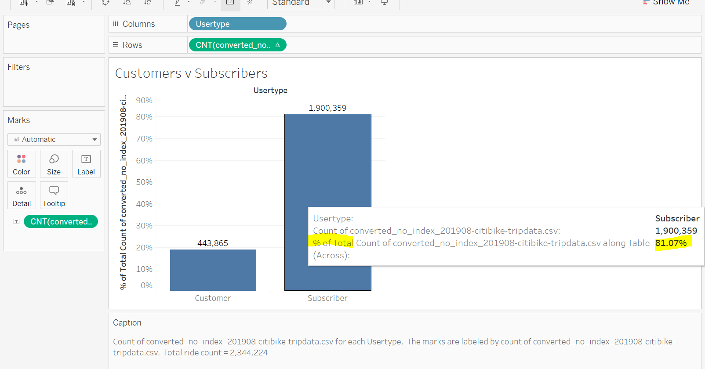
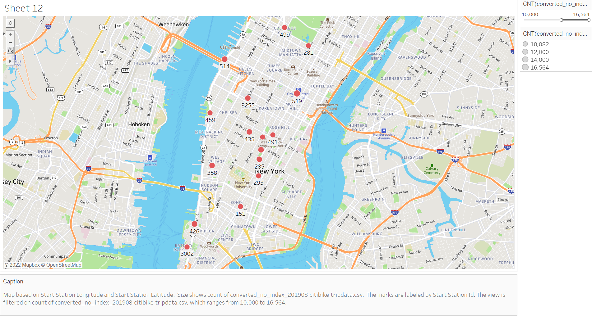

# :bicyclist: bikesharing 

OSU Module 14 - Tableau

### Before working with the dataset, the 'tripduration'column in the original .csv was converted to datetime.

```python
import pandas as pd

# Create a DataFrame for the 201908-citibike-tripdata data.
df = pd.read_csv('201908-citibike-tripdata.csv')

# Convert the 'tripduration' column to datetime datatype.
df['tripduration']= pd.to_datetime(df['tripduration'], unit='s')

# Export the Dataframe as a new CSV file without the index.
df = df.to_csv("converted_no_index_201908-citibike-tripdata.csv", index = False)
```


### Please visit my Public Tableau Page to see the VIZ's.
[link to dashboard](https://public.tableau.com/views/BikeShareChallenge_16457264396390/Dashboard1?:language=en-US&:display_count=n&:origin=viz_share_link)

- Overview of the analysis: You are charged with gathering data from a bikeshare company in New York City in order to assist your salesperson friend, Kate make a pitch to investors in her hometown of Des Moines, Iowa.  Kate would like to start a bikeshare company in Des Moines and has asked you to provide her with visualizations which she can present to her potential investors.

- Results: We looked at NYC CitiBike data for the month of August 2019.  There were a total of 2,344,224 rides that month.  We wanted to see several things:
  - How many customers were repeat (Subscribers) customers
  - How long were most trips
  - What was the gender breakdown for riders
  - What hours of the day were busiest
  - What stations were busiest and were they strategically located

## Over 80% of customers were Subscribers.


## Most rides were under 40 minutes.


## The heatmap below shows most riders identified as 'MALE'.


## The heatmap below shows most activity occurred during 'rush hour'.


## The heatmap below suggests most riders are subscription commuters.


## Further investigation could be made into what % of total rides the top stations have.


## All the top stations are in Manhattan south of Central Park.



- Summary: Most of the NYC CitiBike business seems to come from male commuters in the southern half of Manhattan making short trips during the workweek.

- Considerations for further research:
  - Will Des Moines, IA, a city with one-tenth the population of NYC but a geographic area four-times that of Manhattan be able to support a similar business to CitiBike?
  - Can we delve deeper into the identities of the Subscribers to see how loyal they are?  Distinct customer IDs are not provided in the dataset.
  - Can we look at how the winter months compare to the volume in the August dataset?
