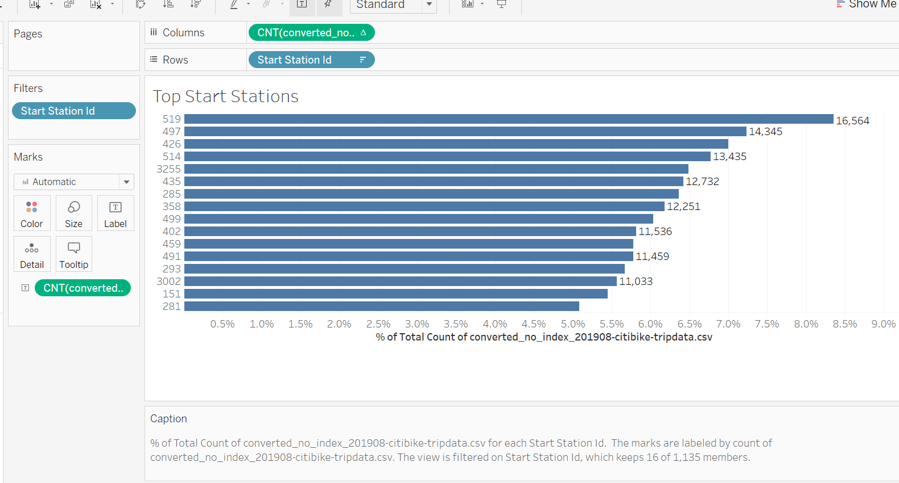

# bikesharing 🚴

OSU Module 14 - Tableau

### Please visit my Public Tableau Page to see the VIZ's.
[link to dashboard](https://public.tableau.com/views/BikeShareChallenge_16457264396390/Dashboard1?:language=en-US&:display_count=n&:origin=viz_share_link)

- Overview of the analysis: Explain the purpose of this analysis.

- Results: Using the visualizations you have in your Tableau Story, describe the results of each visualization underneath the image.

- Summary: Provide a high-level summary of the results and two additional visualizations that you would perform with the given dataset.

Add at least two extra visualizations for a total of seven.

